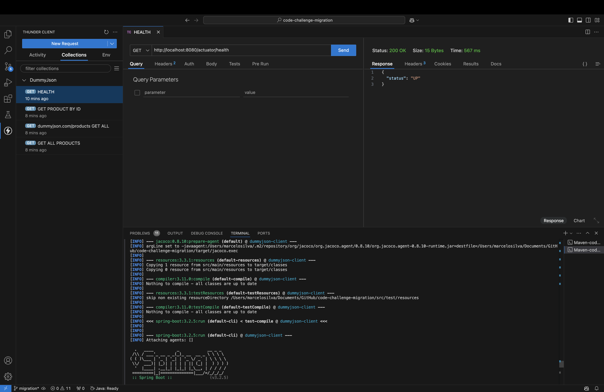
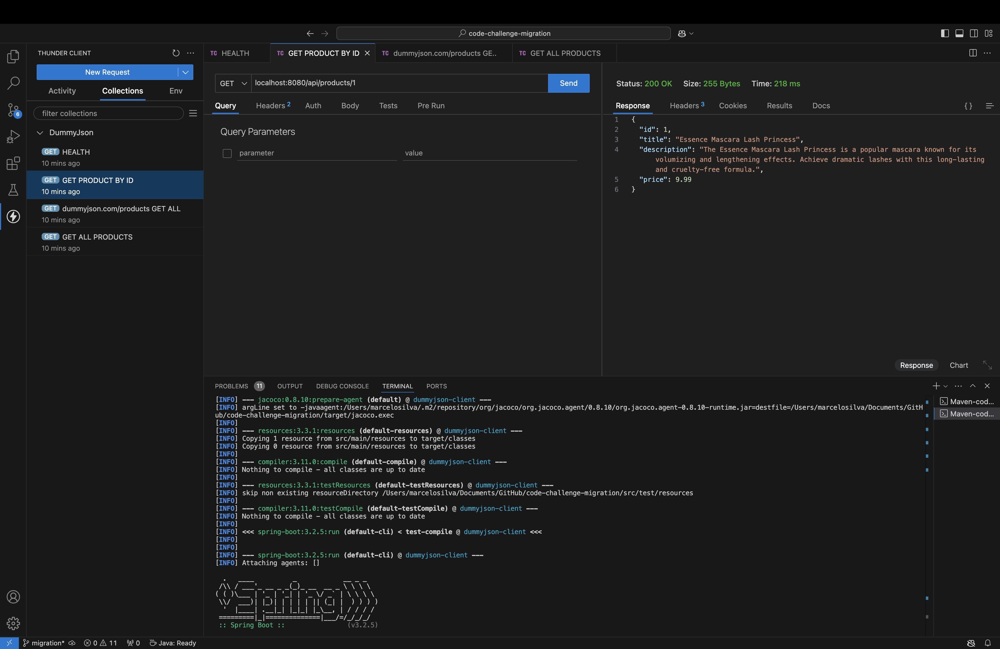
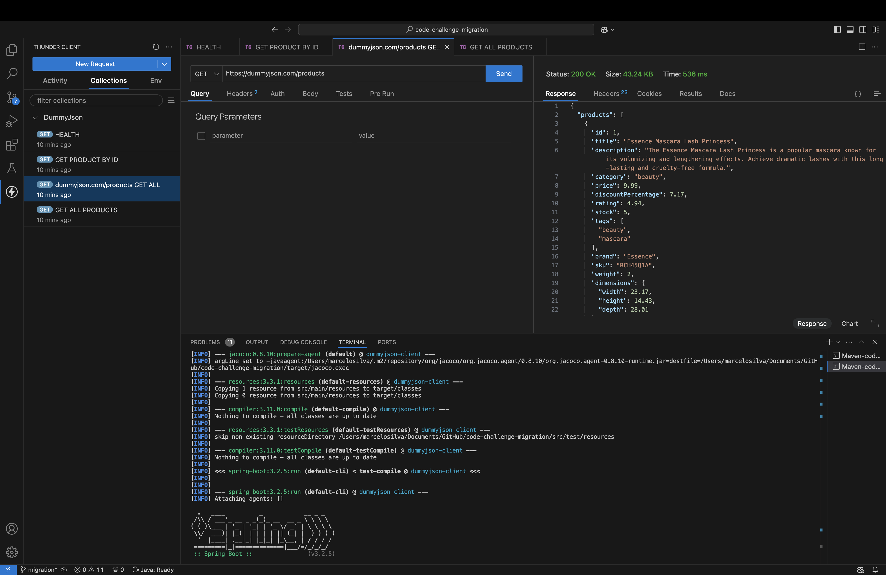
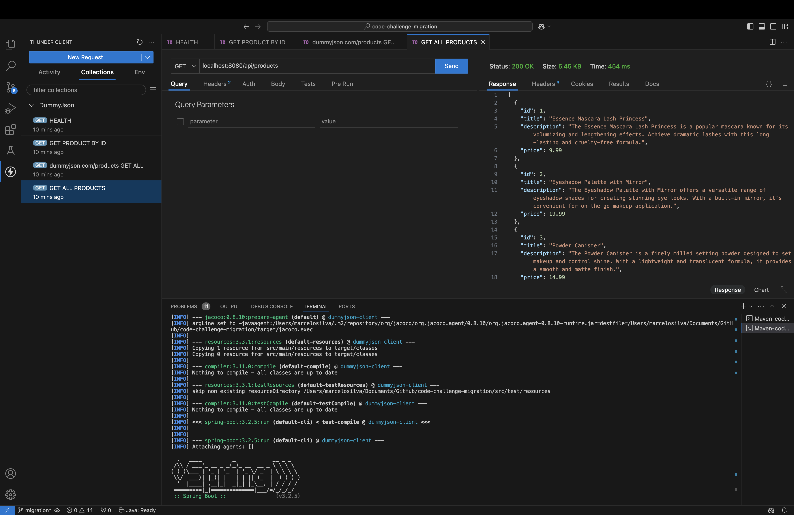

# DummyJSON Client - Java 8 e Spring Boot 2.x.x

## Descrição do Projeto

Este projeto é um microsserviço Java que interage com a API pública [DummyJSON](https://dummyjson.com/docs/products) para realizar operações de busca de produtos. O projeto foi desenvolvido usando Java 17 e Spring Boot 3.2.5.

## Funcionalidades

- **Consulta de Produtos**: Realiza chamadas para a API do DummyJSON para buscar informações sobre produtos.
- **Integração com `WebClient`**: Utiliza `WebClient` para realizar chamadas HTTP.
- **Validação de Dados**: Validação de dados de entrada usando Bean Validation (`jakarta.validation`).
- **Gestão de Dependências**: Configurado para utilizar @Autowired.
- **Testes Unitários**: Inclui testes unitários desenvolvidos com @SpringBootTest.

## Estrutura do Projeto

```bash
dummyjson-client
├── src
│   ├── main
│   │   ├── java
│   │   │   └── com.example.dummyjsonclient
│   │   │       ├── DummyJsonClientApplication.java
│   │   │       ├── config
│   │   │       │   └── ValidationConfig.java
│   │   │       │   └── WebClientConfig.java
│   │   │       ├── controller
│   │   │       │   └── ProductController.java
│   │   │       ├── dto
│   │   │       │   └── Product.java
│   │   │       ├── service
│   │   │       │   └── ProductService.java
│   │   └── resources
│   │       └── application.yaml
│   └── test
│       ├── java
│       │   └── com.example.dummyjsonclient
│       │       ├── config
│       │       │   └── WebClientConfigTest.java
│       │       └── controller
│       │       │   └── ProductControllerTest.java
│       │       ├── dto
│       │       │   └── ProductTest.java
│       │       └── service
│       │           └── ProductServiceTest.java
│       └── resources
└── pom.xml
```

## Passos para Executar o Projeto

### Pré-requisitos

- **Java 17**
- **Maven 3.8.x**

### Executar a Aplicação

1. Clone o repositório:

    ```bash
    git clone https://github.com/marcelobcosta/code-challenge-migration
    cd dummyjson-client
    ```

2. Compile e execute o projeto:

    ```bash
    mvn clean install
    mvn spring-boot:run
    ```

3. Acesse o serviço:

    O serviço estará disponível em `http://localhost:8080`.

### Executar Testes

Para executar os testes unitários:

```bash
mvn clean test
```

Para executar na API, uma collection de chamadas a API foi adicionado no projeto, usando o Thunder Client do VSCode:






### Para rodar em outro ambiente

```bash
mvn spring-boot:run -Dspring-boot.run.profiles=<nome-do-ambiente>
```


## Requisitos de Entrega


3. Substituir os testes unitários feitos com `JUnit 4` e `Mockito` por testes de integração utilizando `@SpringBootTest`.
4. Refatorar qualquer código depreciado ou incompatível.
5. Garantir que todos os testes ainda passam após a migração.
7. Adicionar no projeto um novo path `/health` que retorna a saude do microsserviço.

## Validação Sobre o Challenge

- Todos os testes unitários devem ser executados e passar sem falhas.
- O código deve estar devidamente documentado e organizado.

## Extras

- Entregar o projeto em container será um diferencial.
- Fica a critério do desenvolvedor inserir ou remover dependencias do projeto para garantir o objetivo do challenge.
