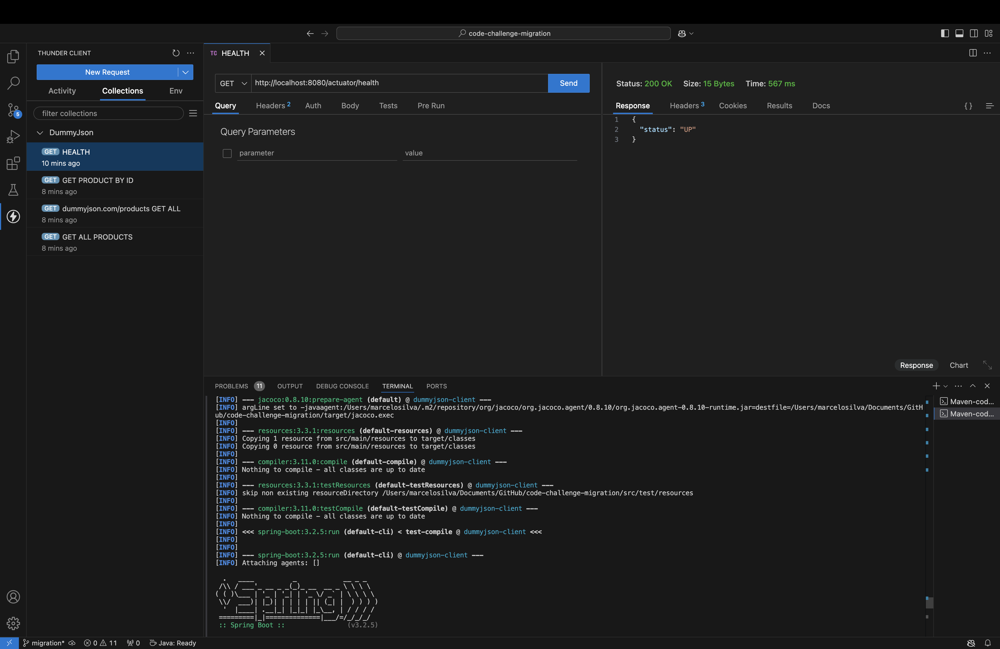
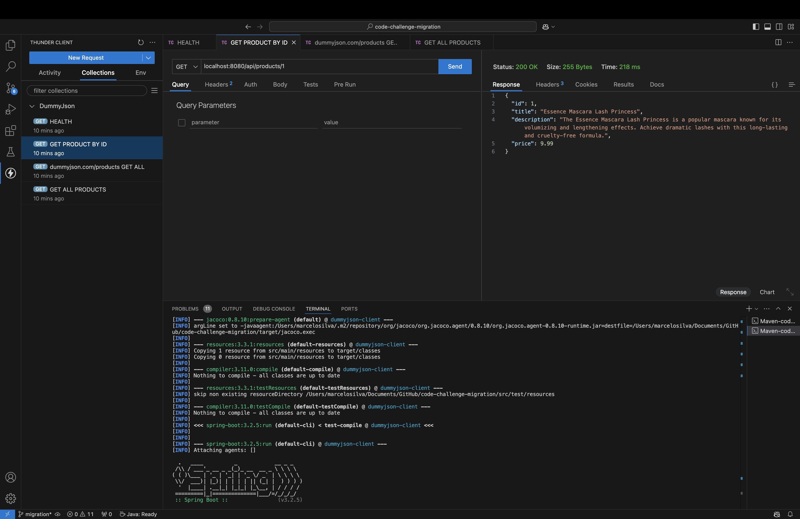
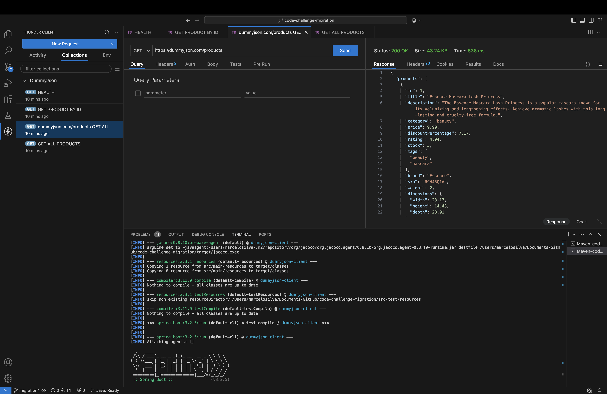
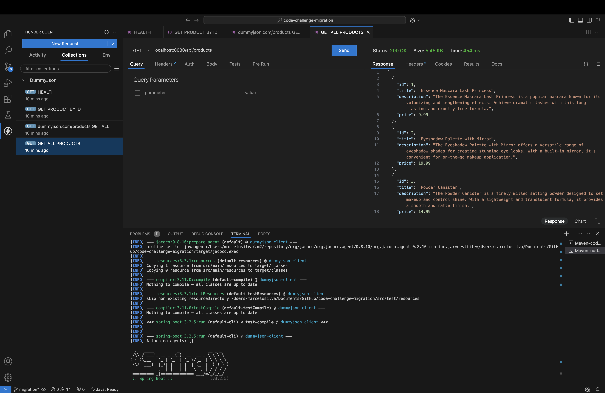

# DummyJSON Client - Java 17 e Spring Boot 3.2.5

## Descrição do Projeto

Este projeto foi desenvolvido como parte de um desafio técnico, com o objetivo de consumir a API pública [DummyJSON](https://dummyjson.com/docs/products) e realizar operações de consulta de produtos. O microsserviço foi implementado usando **Java 17** e **Spring Boot 3.2.5**, e oferece funcionalidades de consulta de produtos, integração com WebClient, validação de dados e testes unitários.

## Funcionalidades

- **Consulta de Produtos**: A aplicação permite buscar todos os produtos ou consultar um produto específico por ID, realizando chamadas para a API do DummyJSON e retornando os dados formatados.
- **Integração com `WebClient`**: Utiliza `WebClient` para realizar chamadas HTTP assíncronas para a API DummyJSON, permitindo escalabilidade e melhor desempenho.
- **Validação de Dados**: Usa Bean Validation (`jakarta.validation`) para validar os dados de entrada nas requisições, garantindo integridade e segurança.
- **Gestão de Dependências**: O Spring Boot é configurado com `@Autowired` para a injeção de dependências, facilitando a manutenção do código.
- **Testes Unitários e Funcionais**: Inclui testes unitários com `@SpringBootTest` e testes funcionais realizados com o Thunder Client para verificar a integração com a API.
- **Execução em Contêiner Docker**: O projeto pode ser executado em contêineres Docker, com a configuração de variáveis de ambiente para diferentes perfis (dev, test, prod).


## Estrutura do Projeto

```bash
dummyjson-client
├── src
│   ├── main
│   │   ├── java
│   │   │   └── com.example.dummyjsonclient
│   │   │       ├── DummyJsonClientApplication.java
│   │   │       ├── config
│   │   │       │   └── ValidationConfig.java
│   │   │       │   └── WebClientConfig.java
│   │   │       ├── controller
│   │   │       │   └── HealthController.java
│   │   │       │   └── ProductController.java
│   │   │       ├── dto
│   │   │       │   └── Product.java
│   │   │       │   └── ProductResponse.java
│   │   │       ├── service
│   │   │       │   └── ProductService.java
│   │   └── resources
│   │       └── application.yaml
│   └── test
│       ├── java
│       │   └── com.example.dummyjsonclient
│       │       ├── config
│       │       │   └── ValidationConfigTest.java
│       │       │   └── WebClientConfigTest.java
│       │       ├── controller
│       │       │   └── HealthControllerTest.java
│       │       │   └── ProductControllerTest.java
│       │       ├── dto
│       │       │   └── ProductTest.java
│       │       │   └── ProductResponseTest.java
│       │       └── service
│       │           └── ProductServiceTest.java
├── Dockerfile
└── pom.xml
```

## Tecnologias usadas
- Java 17: Versão do Java utilizada para garantir compatibilidade com as versões mais recentes e recursos modernos de desenvolvimento.
- Spring Boot 3.2.5: Framework utilizado para simplificar a configuração e o desenvolvimento de microsserviços.
- WebClient: Utilizado para realizar chamadas HTTP assíncronas à API DummyJSON.
- Spring Boot Test (@SpringBootTest): Usado para realizar testes de integração e garantir que os componentes estão funcionando corretamente.
- Maven: Gerenciador de dependências e build automation.
- Docker: Utilizado para empacotar a aplicação em contêineres e permitir a execução em qualquer ambiente com facilidade.


## Passos para Executar o Projeto

### Pré-requisitos

- **Java 17**
- **Maven 3.8.x**
- **Docker** (para execução no contêiner)
- **Dependências do projeto** (especificadas no pom.xml).

### Executar a Aplicação Localmente

1. Clone o repositório:

    ```bash
    git clone https://github.com/marcelobcosta/code-challenge-migration
    cd dummyjson-client
    ```

2. Compile e execute o projeto:

    ```bash
    mvn clean install
    mvn spring-boot:run
    ```

3. Acesse o serviço:

    O serviço estará disponível em `http://localhost:8080` Você pode testar os endpoints da API através de um navegador ou cliente HTTP.

4. Verifique a disponibilidade do microsserviço:

    A saúde do microsserviço pode ser verificada no endpoint `http://localhost:8080/actuator/health`.

### Executar a Aplicação com Docker

1. **Construa a imagem Docker:** Certifique-se de ter o Docker instalado e execute o seguinte comando na raiz do projeto:

    ```bash
    mvn clean install
    docker build -t dummyjson-client .
    ```

2. **Execute o contêiner:** Para rodar a aplicação com Docker, você pode passar a variável de ambiente SPRING_PROFILE para definir o perfil ativo (por exemplo test, dev, prod):

    ```bash
    docker run -e SPRING_PROFILE=dev -p 8080:8080 dummyjson-client
    ```

3. Acesse a aplicação no navegador ou cliente HTTP: 
O serviço estará disponível em `http://localhost:8080`.

### Configuração do application.yaml

- O arquivo `application.yaml` está configurado para trabalhar com diferentes perfis, e você pode ajustar o URL da API de acordo com o ambiente. Por exemplo:

    ```bash
    api:
        url: https://dummyjson.com
    ```
- Quando estiver rodando com Docker, a variável de ambiente SPRING_PROFILE será usada para definir o perfil ativo.

### Executar Testes

- Para executar os testes:

    ```bash
    mvn clean test
    ```

- Para executar os testes de arquivos individualmente:

     ```bash
    mvn clean test -Dtest=<nome-do-arquivo-de-teste>
    ```

### Testes Funcionais com Thunder Client
Uma collection de requisições à API foi adicionada no projeto, usando o Thunder Client do VSCode. Para testar a API:

- Abra o Thunder Client no VSCode.
- Importe a collection de requisições [DummyJson](thunder-collection_DummyJson.json).
- Execute as requisições para testar os endpoints da API.
- Alguns loggers úteis foram deixados comentados no Service e no Controller para facilitar debug






### Para rodar em outro ambiente

- Para rodar a aplicação com um perfil específico em Docker:

    ```bash
    docker run -e SPRING_PROFILE=<nome-do-ambiente> -p 8080:8080 dummyjson-client
    ```

- Exemplo para o ambiente de produção:

    ```bash
    docker run -e SPRING_PROFILE=prod -p 8080:8080 dummyjson-client

    ```

### Endpoint de Saúde (`/health`)

O endpoint `/health` fornece informações detalhadas sobre o estado da aplicação e dependências externas. Ele verifica o status de conectividade com a API DummyJSON, além de retornar métricas importantes sobre a aplicação.

#### Exemplo de Resposta
```json
{
  "memory": {
    "usedMemory": 37558208,
    "freeMemory": 25356352,
    "totalMemory": 62914560
  },
  "system": {
    "architecture": "aarch64",
    "javaVersion": "17.0.2",
    "os": "Linux"
  },
  "externalApi": {
    "status": "UP"
  },
  "version": "1.0.0",
  "status": "UP",
  "uptime": "PT7.07S",
  "timestamp": "2024-12-02T05:48:07.114881971Z"
}
```

#### Campos Retornados
- **`memory`**: Informações sobre o uso de memória da JVM:
  - `usedMemory`: Memória atualmente em uso.
  - `freeMemory`: Memória disponível.
  - `totalMemory`: Memória total alocada para a JVM.
- **`system`**: Informações sobre o ambiente do sistema:
  - `os`: Sistema operacional.
  - `architecture`: Arquitetura do processador.
  - `javaVersion`: Versão do Java em execução.
- **`externalApi`**: Estado da API DummyJSON.
  - `status`: Status da conectividade com a API externa (`UP` ou `DOWN`).
- **`version`**: Versão atual da aplicação.
- **`status`**: Status geral da aplicação (`UP` ou `DOWN`).
- **`uptime`**: Tempo de execução da aplicação desde o início.
- **`timestamp`**: Data e hora da última verificação de saúde.


Este endpoint ajuda a monitorar a saúde da aplicação em tempo real e pode ser integrado com ferramentas de observabilidade como Prometheus ou Grafana.
